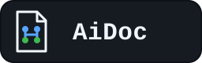
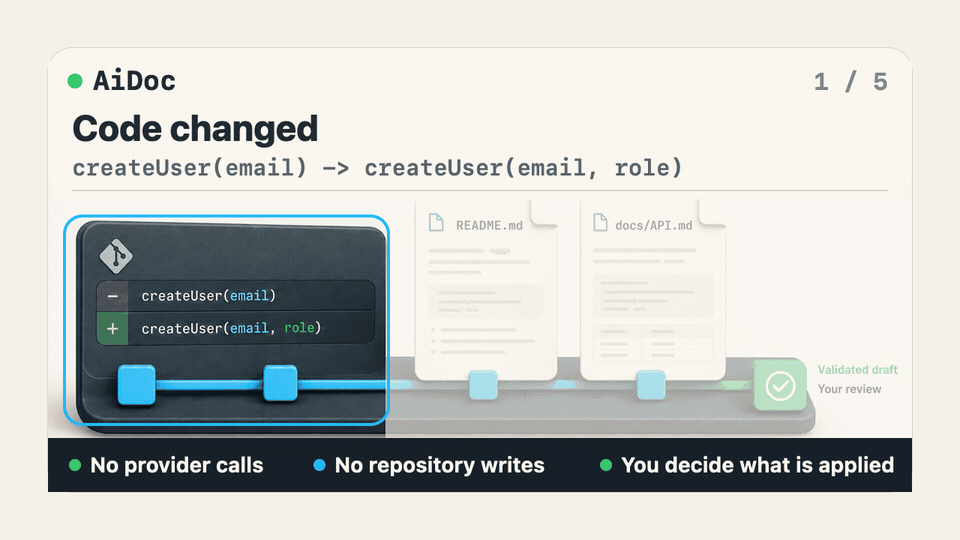

<p align="center">
  
</p>

<p align="center"><strong>Public beta</strong></p>
<p align="center"><strong>Documentation that keeps up with your code.</strong></p>

<p align="center">
  AiDoc helps Codex, Claude, or a supported model create READMEs, API docs,
  changelogs, diagrams, and code comments, then keep them aligned as code
  changes. It analyzes code structure first, focuses the relevant context,
  and keeps change-driven updates reviewable.
</p>

```bash
npm install -g @mr-min-max/aidoc-gen@beta
aidoc
```

[](https://www.npmjs.com/package/@mr-min-max/aidoc-gen)
[](https://github.com/mr-min-max/aidoc/actions/workflows/ci.yml)
[](./LICENSE)
[](https://nodejs.org/)



[Static demo poster](./docs/assets/demo/aidoc-flow-poster.png)

Code signature change -> impact plan -> focused README/API draft ->
validation -> maintainer review.

> [!NOTE]
> This source targets `0.2.0-beta.6`. The `@beta` install command resolves to the currently published npm beta; the [Public Beta guide](./docs/PUBLIC_BETA.md) records the verified release state.

## Create docs and keep them current

### Create project docs

Generate a README, API reference, architecture diagram, or code comments from
AST-backed analysis, and generate a changelog from normalized Git history:

| Create               | Command           |
| -------------------- | ----------------- |
| README               | `aidoc readme`    |
| API docs             | `aidoc api`       |
| Changelog            | `aidoc changelog` |
| Architecture diagram | `aidoc diagram`   |
| Code comments        | `aidoc annotate`  |

The complete command options and output behavior live in the
[CLI catalogue](./docs/CLI.md).

### Keep docs current

When code changes, AiDoc can plan the documentation impact, update selected
Markdown targets, watch a source tree, check co-change freshness, and score
AST-derived coverage:

| Maintain                        | Command        |
| ------------------------------- | -------------- |
| Plan impact                     | `aidoc plan`   |
| Update affected Markdown        | `aidoc update` |
| Watch and regenerate            | `aidoc watch`  |
| Check source/document co-change | `aidoc check`  |
| Score AST coverage              | `aidoc score`  |

Planning, checking, and scoring without an output path are deterministic and
provider-free. A real generated update still needs a model path.

### Connect the workflow

- **Codex MCP:** use the [local Codex guide](./docs/integrations/codex.md).
- **Claude MCP:** use the [Claude guide](./docs/integrations/claude.md).
- **GitHub Action:** use the [Action reference](./docs/GITHUB_ACTION.md) for
  generate and check modes.
- **Direct providers:** configure a supported API provider for CLI generation.
- **Ollama:** use an explicit installed local model when the model and code
  context should stay on the machine.

The [Public Beta guide](./docs/PUBLIC_BETA.md) keeps the provider, billing, and
Trust Gate boundaries in one place.

## How a code change becomes a docs update

The maintenance path is intentionally plan-first. It compares supported source
through the AST, identifies documentation targets, and keeps generation behind
an explicit model and review boundary.

### Analyze the change

AiDoc compares the selected Git range and parses supported TypeScript,
JavaScript, and Python source before a provider could be constructed.

### Focus the update

For the canonical example, the signature changes from
`createUser(email) -> createUser(email, role)`. The impact plan identifies
`README.md` and `docs/API.md` as the documentation targets instead of sending
an unbounded repository dump.

### Review before writing

The model drafts a focused Markdown change, AiDoc validates the result, and the
maintainer or host reviews the diff before any write. The three-step summary is:

1. **Analyze the change.** Compare supported code through ASTs.
2. **Focus the update.** Identify affected docs and prepare bounded context.
3. **Review before writing.** Draft, validate, and inspect the diff.

The standalone create commands remain available for initial project
documentation. They are not all the same as a change-targeted update.

## See the workflow

The repository includes a seeded, deterministic storefront demo. It uses the
same canonical change story:

```text
Change: createUser(email) -> createUser(email, role)
Impact: README.md, docs/API.md
Host contract: prepare -> host draft -> validate
Provider calls: none
Repository writes: none
```

Run it from a clean repository checkout:

```bash
git clone https://github.com/mr-min-max/aidoc.git
cd aidoc
npm ci
npm run demo:storefront
```

The demo exercises AiDoc's provider-free preparation and validation contract. It
does not claim that an automated script invoked Codex. The host is responsible
for creating a candidate from the returned bounded prompts and for requesting
its normal write permission. The [demo test](./tests/e2e/storefront-demo.test.mjs)
keeps this output deterministic.

## What AiDoc can do

AiDoc has three connected jobs:

### Create

Use `readme`, `api`, `changelog`, `diagram`, and `annotate` for initial
documentation and source comments. Real CLI generation uses a supported direct
provider credential or an explicit local Ollama model. The `--mock` option is
for tests and local demonstrations.

### Maintain

Use `plan` to understand impact, `update` to generate a focused change,
`watch` to regenerate after relevant source changes, `check` to guard
source/document co-change, and `score` to measure AST-derived coverage.

### Connect

The local [Codex MCP](./docs/integrations/codex.md) and
[Claude MCP](./docs/integrations/claude.md) paths prepare and validate Markdown
without writing. The [GitHub Action](./docs/GITHUB_ACTION.md) provides
provider-backed generation and deterministic check mode in CI. Direct provider
profiles and Ollama are documented in [Public Beta](./docs/PUBLIC_BETA.md).

## Why AST-first matters

AiDoc starts with deterministic structure: exported functions, classes, methods,
types, and references. It then focuses the context passed to a model and keeps
the resulting update reviewable. AST analysis is a boundary for relevance and
change mapping; it is not a guarantee that generated prose is correct.

The comparison is between workflow patterns, not named competitors:

| One-shot generation pattern              | AiDoc workflow                       |
| ---------------------------------------- | ------------------------------------ |
| Starts from a broad prompt               | Starts from AST-derived changes      |
| Rewrites whatever it is asked to rewrite | Maps changes to affected docs        |
| Leaves context scope to the caller       | Prepares bounded context             |
| Treats output as the end of the flow     | Keeps validation and review explicit |

## Quick starts

### Seeded demo: no provider required

After completing the checkout and `npm ci` steps in **See the workflow**, run
the fixed provider-free fixture:

```bash
npm run demo:storefront
```

It shows the `createUser(email) -> createUser(email, role)` story, the
README/API targets, the host prepare/validate contract, and the no-write result.

### Changed repository: plan first

After installing the beta, run the bare command in a repository with a real
code change:

```bash
npm install -g @mr-min-max/aidoc-gen@beta
aidoc
```

Bare `aidoc` is allowed to plan provider-free in a changed repository. Use
`aidoc plan` when you want an explicit non-interactive plan:

```bash
aidoc plan
aidoc plan --json
```

The plan does not write docs. If you accept a generated update, choose a direct
provider or the separate host-managed MCP path. If the repository is clean,
there is no change story to show, so use the seeded demo above.

### Initial generation: choose a model path

For the first README or API document, choose one of these honest paths:

1. **Direct CLI provider:** set a supported provider credential and run
   `aidoc readme`, `aidoc api`, or another create command.
2. **Local Ollama:** install and select an explicit Ollama model, then run the
   same CLI command without a remote API key.
3. **Host-managed MCP:** use Codex or Claude to call
   `prepare_documentation_update` and `validate_documentation_draft`. The
   provider-free AiDoc boundary never writes; the host applies only approved
   Markdown after its normal permission check.

Direct CLI generation requires a supported provider credential or an explicit
local Ollama model. A consumer subscription alone is not an AiDoc API key.

### Codex host path

Install the CLI, add the local server, and keep the repository scope pinned to
the worktree where the server starts:

```bash
npm install -g @mr-min-max/aidoc-gen@beta
codex mcp add aidoc -- aidoc --mcp
codex mcp list
```

Follow the [Codex integration guide](./docs/integrations/codex.md) for the
prepare, host draft, validate, review, permission, and freshness sequence.
Claude users can follow the [Claude guide](./docs/integrations/claude.md).

### Direct provider or Ollama path

Direct providers use their own API billing and credentials. Ollama is local but
still needs an explicit installed model for non-interactive use. Provider
selection never silently falls back. See [Public Beta](./docs/PUBLIC_BETA.md)
for the exact profiles, environment variables, Qwen PAYG boundary, and Ollama
discovery behavior.

## Safety and boundaries

### Provider and host boundaries

`aidoc plan`, `aidoc check`, and `aidoc score` without `--output` do not need a
provider. Real direct CLI generation requires a supported provider credential or
an explicit local Ollama model. The host-managed MCP prepare/validate path is
provider-free and never writes the repository. A host applies only the exact
approved Markdown after its normal permission check.

### Trust Gate

For direct and general provider flows, `strict` blocks detected high-confidence
secrets, `redact` replaces them with typed placeholders, and `warn` preserves
the detected text while reporting findings. The host-managed MCP path has a
stricter privacy floor: `warn` and `redact` both use effective redaction before
host generation or return. Trust Gate does not control a host's context window,
model, sandbox, isolation, or permission system.

### Pinned MCP scope

Each MCP server serves one canonical Git worktree: the worktree where it
started. Start another server for another repository. Repository-relative paths
are returned; external paths, parent traversal, Git metadata, missing
directories, and symlinks or junctions fail closed. MCP configuration is limited
to bounded declarative JSON, YAML, no-extension files, package.json#aidoc, and
the pinned root .env allowlist. Executable JavaScript, TypeScript, CJS, MJS, and
the legacy secret-bearing apiKey field are rejected.

This repository scope is not an operating-system sandbox. The host's own
permissions remain authoritative. See the [Public Beta boundaries](./docs/PUBLIC_BETA.md)
and the [host guides](./docs/integrations/codex.md) for the full scope.

### GitHub Action

The Action's generate mode uses a provider and can optionally commit only the
files AiDoc reports as changed. Its check mode is deterministic and needs no
provider key. Use the [Action reference](./docs/GITHUB_ACTION.md) for inputs,
outputs, trust-policy behavior, dry-run, staged-change refusal, and permissions.

## Supported languages and current limits

AiDoc currently has AST parser support for TypeScript, JavaScript, and Python.
Supported source is parsed before model generation. In the plan and
change-targeted update paths, a supported-file parse failure stops before
provider construction or a document write. During impact planning, unsupported
or configured-excluded files are counted as limits and are not sent to a
provider.

`aidoc check` is an AST-backed co-change guard, not semantic proof.
`aidoc score` is AST-derived documentation coverage, not prose quality.
Provider-backed output can still be wrong, so review every diff. The current
beta does not promise a documentation website, autonomous updates, or an
operating-system sandbox.

Report a reproducible issue with the command, repository shape, and observed
output through the [issue tracker](https://github.com/mr-min-max/aidoc/issues/new).
Use [CONTRIBUTING.md](./CONTRIBUTING.md) for changes and
[SECURITY.md](./SECURITY.md) for private security reports.

## Contributing and feedback

Start with [CONTRIBUTING.md](./CONTRIBUTING.md), review the
[code of conduct](./CODE_OF_CONDUCT.md), and use the
[issue tracker](https://github.com/mr-min-max/aidoc/issues) for bugs,
questions, and focused feature requests. For beta access boundaries and
version truth, read [Public Beta](./docs/PUBLIC_BETA.md).

This source targets beta.6. For verified publication state, use
[Public Beta](./docs/PUBLIC_BETA.md). The project is MIT licensed; see
[LICENSE](./LICENSE).
